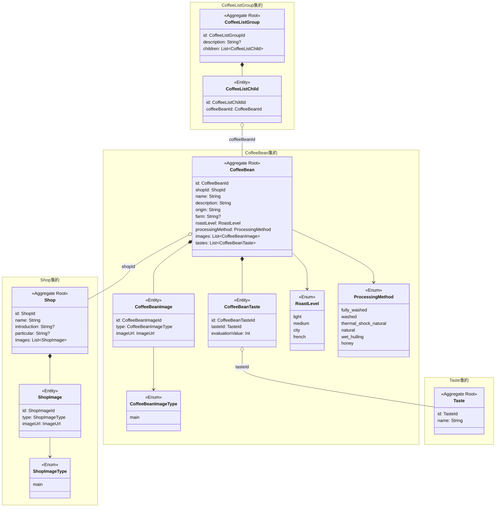

# ドメインモデル図

## 集約一覧

| 集約 | 概要 |
|------|------|
| [Shop](domains/shop.md) | 珈琲豆を提供する店舗 |
| [CoffeeBean](domains/coffeeBean.md) | 店舗が提供する珈琲豆 |
| [Taste](domains/taste.md) | テイスト評価の種別（酸味・苦味など） |
| [CoffeeListGroup](domains/coffeeListGroup.md) | CSサイトに表示する珈琲豆リスト |

## ドメインモデル図

## 凡例

| 記号 | 意味 |
|------|------|
| `<<Aggregate Root>>` | 集約ルート。トランザクション整合性の境界 |
| `<<Entity>>` | 集約内のエンティティ。集約ルート経由でのみアクセス |
| `<<Value Object>>` | 値オブジェクト。不変で同値性で比較 |
| `<<Enum>>` | 列挙型。取りうる値が固定された値オブジェクト |
| `*--` (塗りつぶし菱形) | コンポジション。親が子のライフサイクルを管理 |
| `o--` (白抜き菱形) | ID参照。他の集約をIDで参照（直接保持しない） |
| `-->` | 依存。値オブジェクトの利用など |
