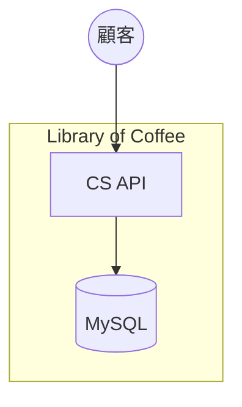

# システム関連図

## 構成要素

| 種別 | 名前 | 説明 |
|------|------|------|
| アクター | 顧客 | 珈琲豆の閲覧・選択を行う利用者 |
| 自システム | CS API | 顧客向けバックエンドAPI |
| 自システム | MySQL | データベース |

## 注釈

- 個人情報やクレジットカード情報などセンシティブなデータは自システムでは保持しない。
