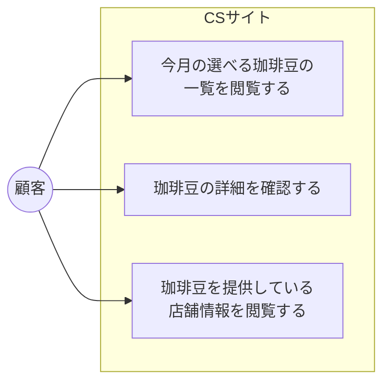

# ユースケース図

## 顧客側ユースケース

## ユースケース一覧

| # | ユースケース |
|---|------------|
| CS-1 | 今月の選べる珈琲豆の一覧を閲覧する |
| CS-2 | 珈琲豆の詳細を確認する |
| CS-3 | 珈琲豆を提供している店舗情報を閲覧する |

## 凡例

| 記号 | 意味 |
|------|------|
| `(("名前"))` | アクター |
| `["名前"]` | ユースケース |
| `subgraph` | システム境界 |
| `-->` | アクターがユースケースを実行する |
